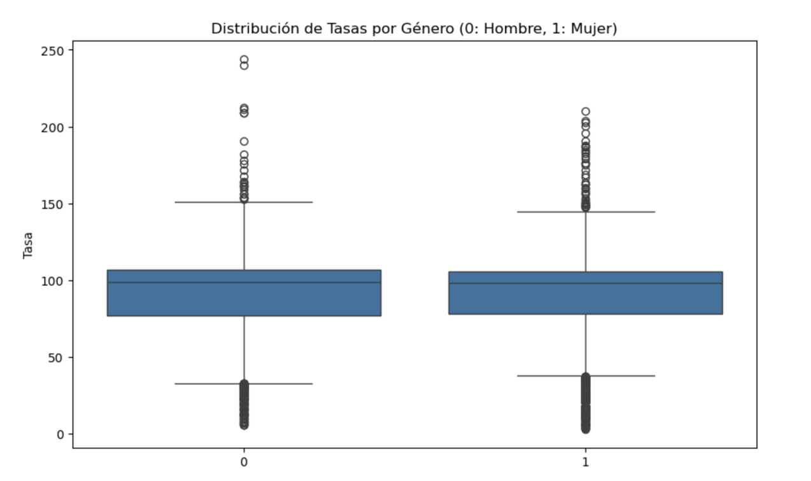
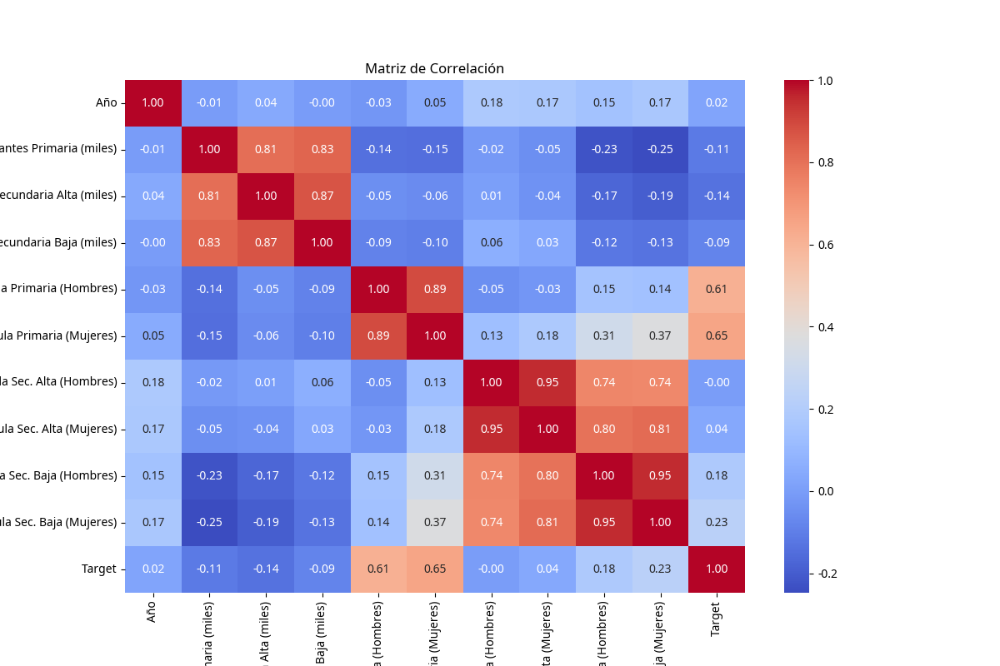
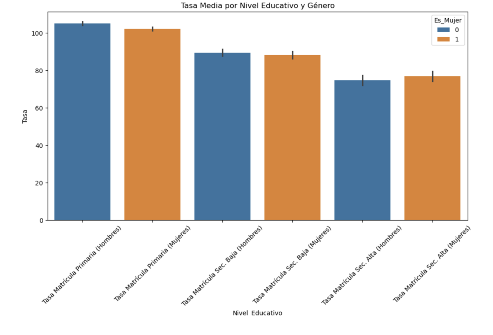
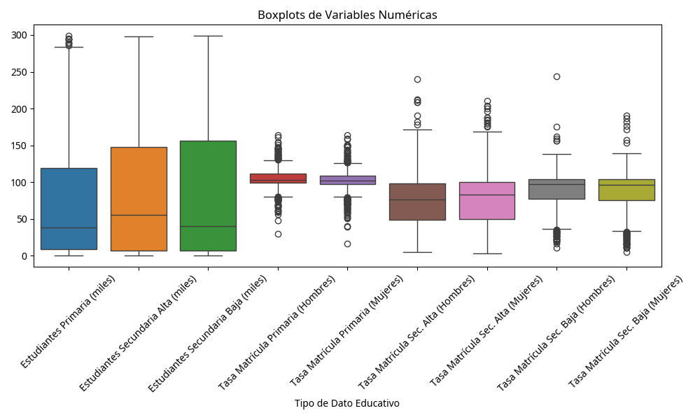
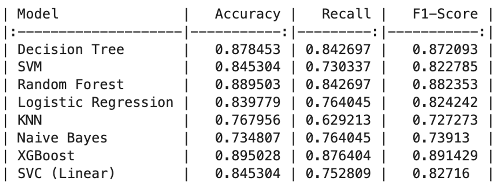
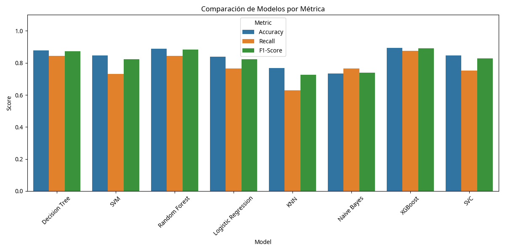
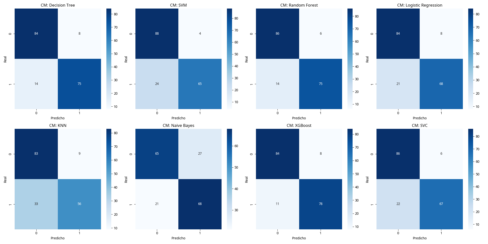

## **Resultados Visuales**

A continuación, se presentan los hallazgos gráficos obtenidos tras aplicar los 8 modelos de clasificación sobre el dataset educativo.

| Figura | Título | Descripción |
| :--- | :--- | :--- |
| **1** | **Boxplots Tasa Género** | Análisis de variabilidad en la distribución de Tasa por Género mediante diagramas de caja.|
| **2** | **Matriz de Correlación** | Mapa de calor que ilustra las relaciones entre indicadores socio-educativos y la variable objetivo. |
| **3** | **Comparativa Tasa Matrícula** | Comparación de la tasa de matrícula por nivel educativo y género.|
| **4** | **Boxplots** | Análisis de variabilidad en niveles secundarios mediante diagramas de caja.|
| **5** | **Resumen Métricas** | Imagen de tabla que resume las métricas más importantes para los 8 modelos. |
| **6** | **Comparativa de Modelos** | Comparación de rendimiento (Accuracy) entre los diferentes clasificadores evaluados.|
| **7** | **Matriz de Confusión** | Representación consolidada de los aciertos y clasificaciones erróneas del modelo final. |

---

### **Detalle de las Figuras**

### **Figura 1 - Distribución de tasa por género**

### **Figura 2 - Matriz de Correlación**

### **Figura 3 - Tasa Media por Nivel Educativo y Género**

### **Figura 4 - Boxplots de Tasa de matrícula Hombres y Mujeres**

### **Figura 5 - Métricas de los modelos**

### **Figura 6 - Comparativa de Modelos**

### **Figura 7 - Matriz de Confusión**

